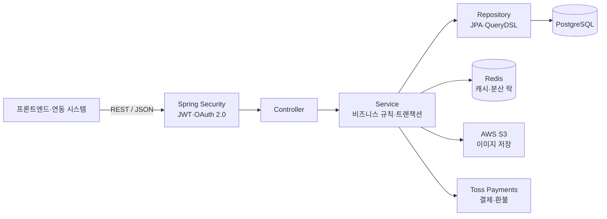

# H-OUR

H-OUR는 가죽공방의 브랜드 경험, 상품 구매, 원데이 클래스 예약을 하나의 서비스에서 제공하기 위한 팀 프로젝트입니다.  
이 저장소는 H-OUR의 백엔드 API를 관리하며, 회원·상품·주문·결제·수업·예약과 관리자 운영 기능을 제공합니다.

## 프로젝트 개요

가죽공방의 철학과 제품을 온라인에서도 전달하고, 쇼핑과 클래스 예약을 각각 관리해야 하는 불편을 줄이는 것이 프로젝트의 출발점입니다.

주요 사용자는 제품을 구매하거나 원데이 클래스를 예약하는 고객과 공방 운영자입니다. 고객은 이메일 또는 Google OAuth로 가입·로그인하고, 상품을 장바구니에 담아 주문하거나 원하는 수업 시간을 예약할 수 있습니다. 운영자는 회원, 상품, 카테고리, 주문, 수업, 예약 및 운영 정책을 관리하고 대시보드에서 주요 집계 정보를 확인할 수 있습니다.

백엔드는 프론트엔드와 외부 결제 시스템에 REST API를 제공하도록 구성했습니다. 별도의 AI 모듈은 이 저장소에 포함되어 있지 않으며, AI를 포함한 추가 연동 시스템은 공개 API와 인증 규약을 기준으로 연결할 수 있습니다.

## 주요 기능

| 영역 | 제공 기능 |
| --- | --- |
| 인증·회원 | 이메일 회원가입/로그인, Google OAuth, JWT 갱신·로그아웃, 내 정보·비밀번호·회원 탈퇴 |
| 주소 | 배송지 등록·조회·수정·삭제, 대표 배송지 설정 |
| 상품·카테고리 | 상품/카테고리 조회, 관리자 CRUD, 이미지 업로드, 검색·필터 |
| 장바구니·주문 | 장바구니 상품 관리, 단일 상품/장바구니 주문, 주문 조회·상태 관리·취소 |
| 결제 | 주문·예약 결제 승인, 결제/영수증 조회, 환불, Toss Payments 연동 |
| 수업·예약 | 수업·운영 정책 조회, 예약 가능 시간 조회, 예약 생성·내역 조회, 관리자 상태 변경 |
| 관리자 | 회원 권한·블랙리스트, 상품·주문·수업·예약·배송비 정책 관리, 운영 대시보드 |

상세 요청·응답 형식은 [API 문서](docs/API_DOCUMENT.md)를 참고하세요. 애플리케이션 실행 후에는 Swagger UI에서도 API를 확인할 수 있습니다.

## 기술 스택

- Java 25, Spring Boot 4.0.7, Gradle
- Spring MVC, Spring Data JPA, QueryDSL
- Spring Security, OAuth 2.0 Client, JWT
- PostgreSQL, Redis, Redisson, Spring Cache
- AWS S3, Toss Payments
- springdoc OpenAPI, Logstash Logback Encoder
- JUnit 5, Spring Security Test
- Docker, Docker Compose, GitHub Actions

## 아키텍처



소스는 기능 도메인별로 나누고, 각 도메인 내부를 `controller`, `service`, `repository`, `domain`, `dto` 계층으로 구성했습니다.

```text
src/main/java/stitch/crew/hour
├── auth, user, address
├── category, product, image
├── cart, cartproduct
├── order, orderproduct, payment
├── lesson, reservation, policy
├── admin
└── common
    ├── config       # Security, Redis, S3, Swagger 등
    ├── exception    # 공통 예외 처리
    ├── lock         # Redisson 기반 분산 락
    └── response     # 공통 API 응답
```

### 주요 설계

- 인증: Access/Refresh JWT와 Spring Security 필터 체인을 사용하며, Google OAuth 신규 가입 흐름은 제한 시간 있는 Signup Token으로 연결합니다.
- 데이터 접근: JPA를 기본으로 사용하고, 관리자 검색·대시보드 집계 등 동적 조회에는 QueryDSL을 사용합니다.
- 동시성: 동일 수업 시간의 중복 예약을 제어하기 위해 Redis/Redisson 기반 분산 락을 적용합니다.
- 성능: 반복 조회되는 수업·정책 데이터에 Spring Cache를 적용하고, 예약 조회 조건에는 데이터베이스 인덱스를 사용합니다.
- 파일: 상품과 카테고리 이미지는 AWS S3에 저장합니다.
- 외부 결제: Toss Payments 승인·조회·환불 API와 주문/예약 상태 변경을 연결합니다.

### 발표 당시 운영 구성

발표 당시에는 프론트엔드, 백엔드, PostgreSQL, Redis와 외부 S3·Toss Payments를 운영 환경에서 연결해 전체 사용자 흐름을 시연했습니다. GitHub Actions는 애플리케이션 테스트와 Docker 이미지 빌드·배포에 사용했습니다.

ELK 환경과 Logstash 전송 설정도 구성했지만, 수집할 운영 데이터와 활용 기준을 확정하지 못해 실제 발표 시연 범위에는 포함하지 않았습니다. 현재 저장소에는 백엔드의 Logstash 설정만 있으며, VPC·NGINX·Elasticsearch·Kibana 등 전체 운영 인프라 정의는 포함되어 있지 않습니다.

발표자료의 PostGIS 위치 기능과 pgvector 기반 AI 유사도 검색은 확장성을 검토한 설계 항목이며, 현재 코드에 구현된 기능이 아닙니다.

## 실행 방법

### 사전 요구사항

- JDK 25
- Docker 및 Docker Compose
- Google OAuth, AWS S3, Toss Payments 연동 정보

### 1. 환경 변수 준비

개발 환경은 루트의 `.env.dev`를 사용합니다. 실제 자격 증명은 저장소나 문서에 노출하지 말고 각 팀의 비밀 관리 수단으로 전달하세요.

필요한 변수 그룹은 다음과 같습니다.

| 그룹 | 변수 |
| --- | --- |
| Spring | `SPRING_PROFILES_ACTIVE` |
| PostgreSQL | `DB_HOST`, `DB_PORT`, `DB_NAME`, `DB_USERNAME`, `DB_PASSWORD`, `POSTGRES_DB`, `POSTGRES_USER`, `POSTGRES_PASSWORD` |
| Redis | `REDIS_HOST`, `REDIS_PORT` |
| JWT | `JWT_APP_KEY`, `JWT_SECRET_KEY` |
| OAuth | `GOOGLE_CLIENT_ID`, `GOOGLE_CLIENT_SECRET`, `OAUTH_SIGNUP_TOKEN_TTL_MS`, `FRONTEND_BASE_URL` |
| S3 | `S3_ACCESS_KEY`, `S3_SECRET_KEY`, `S3_REGION`, `S3_BUCKET` |
| 결제 | `TOSS_PAYMENT_BASE_URL`, `TOSS_PAYMENT_CLIENT_KEY`, `TOSS_PAYMENT_SECRET_KEY` |
| 초기 관리자 | `INITIAL_ADMIN_EMAIL`, `INITIAL_ADMIN_PASSWORD`, `INITIAL_ADMIN_USER_NAME`, `INITIAL_ADMIN_PHONE_NUMBER`, `INITIAL_ADMIN_NATIONALITY` |

### 2. PostgreSQL과 Redis 실행

```bash
docker compose up -d db redis
```

기본 포트는 PostgreSQL `5432`, Redis `6379`입니다. 이미 같은 포트를 사용하는 서비스가 있다면 Compose 또는 환경 변수 설정을 조정하세요.

### 3. 애플리케이션 실행

macOS/Linux:

```bash
SPRING_PROFILES_ACTIVE=dev ./gradlew bootRun
```

Windows PowerShell:

```powershell
$env:SPRING_PROFILES_ACTIVE = "dev"
.\gradlew.bat bootRun
```

서버가 시작되면 기본 주소는 `http://localhost:8080`입니다.

### 4. API 확인

- Swagger UI: `http://localhost:8080/v3/swagger-ui`
- OpenAPI JSON: `http://localhost:8080/v3/api-docs`
- 정적 API 명세: [docs/API_DOCUMENT.md](docs/API_DOCUMENT.md)

보호된 API는 로그인 후 발급받은 Access Token을 다음과 같이 전달합니다.

```http
Authorization: Bearer <access-token>
```

## 테스트와 빌드

macOS/Linux:

```bash
./gradlew test
./gradlew build
```

Windows:

```powershell
.\gradlew.bat test
.\gradlew.bat build
```

Pull Request가 `dev` 또는 `main` 브랜치를 대상으로 생성되면 GitHub Actions가 JDK 25 환경에서 전체 테스트를 실행합니다. Docker 이미지는 멀티 스테이지 빌드로 애플리케이션 JAR을 만들고, 기본적으로 `prod` 프로필로 실행합니다.

### 예약 동시성 검증

발표 준비 과정에서 100개의 동시 요청을 발생시키는 테스트를 수행했고, 발표자료에 실행 결과 화면을 기록했습니다. 날짜 단위의 Redisson 분산 락과 예약 검증 로직을 조정한 뒤 해당 실행에서 예약 정합성 100%를 확인했습니다.

다만 현재 저장소의 동시성 테스트는 결과를 로그로 출력하며, 동일 시간 중복 예약을 assertion으로 검증하는 회귀 테스트는 주석 처리되어 있습니다. 따라서 이 수치는 발표 당시 실행 기록이며, 현재 빌드에서 자동으로 재검증되는 성능 보증값은 아닙니다.

## 연동 시스템 개발 가이드

- 공통 응답과 오류 형식, 엔드포인트별 계약은 [API 문서](docs/API_DOCUMENT.md)를 기준으로 구현합니다.
- 일반 로그인과 OAuth 흐름이 다르므로 OAuth 리다이렉트와 신규 가입용 Signup Token 절차를 별도로 처리합니다.
- 신규 OAuth 사용자의 Signup Token은 HttpOnly 쿠키로 전달됩니다. 기존 OAuth 회원의 Access/Refresh Token 전달 방식은 현재 코드와 배포 설정을 확인해 연동해야 합니다.
- 브라우저 기반 클라이언트는 허용된 `FRONTEND_BASE_URL`과 CORS 자격 증명 정책을 맞춰야 합니다.
- 상품/카테고리 등록은 이미지가 포함될 수 있으므로 `multipart/form-data` 지원 여부를 확인합니다.
- 주문 결제와 예약 결제는 동일 결제 API를 사용하되 `paymentType`과 대상 번호를 구분합니다.
- AI 또는 자동화 클라이언트도 일반 API 소비자와 동일하게 인증, 권한, 요청 제한 및 개인정보 처리 원칙을 지켜야 합니다.
- 코드와 정적 API 문서가 다를 경우 임의로 추정하지 말고 담당 팀과 계약을 확인한 뒤 문서를 함께 수정합니다.

## 팀 협업과 담당 영역

아래 내용은 발표자료의 팀 구성 및 R&R과 이 저장소의 Git 작성자·변경 이력을 함께 대조해 정리했습니다. 공동 논의로 결정된 프로젝트 설계를 개인 구현 성과로 귀속하지 않았습니다.

| 팀원(Git 식별자) | 핵심 담당 영역 | 연동·운영 영역 | 테스트·품질 활동 |
| --- | --- | --- | --- |
| 김진비 (`wlsql852`) | 카테고리, 수업·수업 정책, 예약 API | S3 적용 지원, Redis 분산 락·캐시·예약 인덱스, CI/CD 초기 설정 | 카테고리·수업·예약 및 동시성 테스트 |
| 이정수 (`FA-50`) | 상품, 장바구니, 주문, 결제, 배송비 정책 | Docker/Compose, Swagger, Toss Payments, ELK 환경·구조화 로깅 | 상품·장바구니·주문·결제·정책 테스트 |
| 한승우 (`H-SeungWoo`) | 인증·OAuth, 회원, 주소, 관리자 조회·대시보드 | JWT 보안 필터, 프론트엔드 인증 연동, QueryDSL 관리자 검색 | 인증·회원·주소·관리자 및 보안 테스트 |

### 공동 결과

- 사용자 구매와 클래스 예약 흐름을 하나의 백엔드 도메인 모델과 API로 통합했습니다.
- 공통 응답·예외 처리, 인증·권한 경계, 도메인별 계층 구조를 함께 적용했습니다.
- PR/이슈 템플릿과 CI/CD 워크플로를 사용해 변경 검토와 자동 테스트 절차를 마련했습니다.
- API 문서와 Swagger를 제공해 프론트엔드 및 외부 시스템이 독립적으로 연동 계약을 확인할 수 있게 했습니다.

개인별 상세 트러블슈팅이나 회고는 이 공식 README에 포함하지 않습니다. 별도 문서가 추가되면 `docs/` 아래에 보관하고 이 섹션에서 링크합니다.

## 협업 규칙

1. 작업 전 이슈를 만들고 기능, 수정, 리팩터링 등 변경 목적을 명시합니다.
2. 도메인 경계를 지키고 공통 변경이 다른 기능에 미치는 영향을 PR에 기록합니다.
3. API 계약 변경 시 코드, 테스트, Swagger 설명 및 `docs/API_DOCUMENT.md`를 함께 갱신합니다.
4. 자격 증명과 개인정보를 커밋하지 않습니다.
5. PR은 자동 테스트 결과와 리뷰를 확인한 뒤 병합합니다.

관련 양식은 [Issue templates](.github/ISSUE_TEMPLATE)와 [Pull Request template](.github/PULL_REQUEST_TEMPLATE.md)에서 확인할 수 있습니다.
