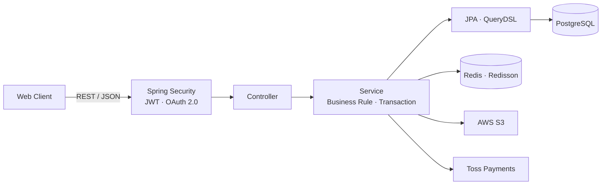
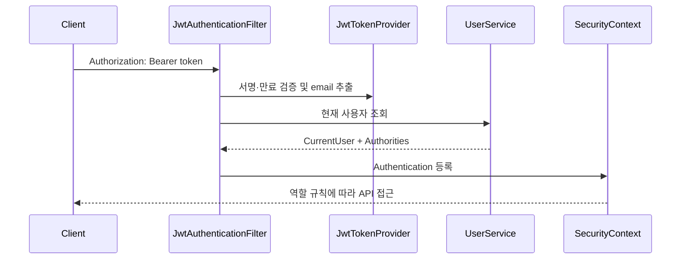
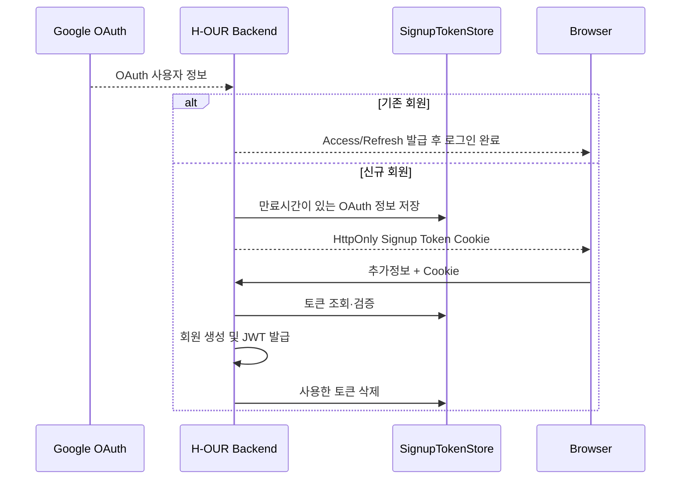

# H-OUR Backend

> 가죽공방의 상품 구매와 원데이 클래스 예약을 하나의 서비스로 연결한 백엔드 팀 프로젝트입니다.<br>
> 이 문서는 백엔드 개발자 **한승우**가 담당한 문제와 기술적 판단을 중심으로 정리한 개인 포트폴리오 README입니다.

## 1. 프로젝트 한눈에 보기

| 구분 | 내용 |
| --- | --- |
| 개발 형태 | 3인 백엔드 팀 프로젝트 |
| 핵심 사용자 | 가죽 상품·클래스를 이용하는 고객, 서비스를 운영하는 관리자 |
| 핵심 기능 | 회원·인증, 상품·주문·결제, 수업·예약, 관리자 운영 |
| 담당 영역 | 인증·인가, Google OAuth, 회원·주소, 관리자 조회·대시보드 |
| 기술 스택 | Java 25, Spring Boot 4.0.7, Spring Security, JPA, QueryDSL, PostgreSQL, Redis |
| 외부 연동 | Google OAuth, AWS S3, Toss Payments |

H-OUR는 공방 고객이 상품 구매와 클래스 예약을 서로 다른 채널에서 처리해야 하는 불편을 줄이고, 운영자가 회원·상품·주문·예약 현황을 한곳에서 관리할 수 있도록 만든 서비스입니다.

백엔드는 프론트엔드에 REST API를 제공하고, PostgreSQL에 주요 도메인 데이터를 저장합니다. Redis/Redisson은 캐시와 예약 동시성 제어에 사용하며, S3와 Toss Payments를 각각 이미지 저장과 결제에 연동했습니다.

## 2. 제가 맡은 역할

Git 작성자 `한승우 <tmddn_00@naver.com>`와 `H-SeungWoo`의 커밋·변경 파일을 기준으로 담당 범위를 정리했습니다. 공동 설계나 다른 팀원의 구현을 개인 성과로 포함하지 않았습니다.

### 핵심 담당

- 이메일 회원가입·로그인과 Access/Refresh JWT 발급, 갱신, 로그아웃
- Spring Security 필터 기반 인증 및 역할별 접근 제어
- 인증 실패와 권한 부족 응답의 JSON 형식 통일
- Google OAuth 기존 회원 로그인과 신규 회원 추가정보 입력 흐름
- 신규 OAuth 가입용 일회성 Signup Token과 HttpOnly 쿠키 전달
- 회원 정보 수정·탈퇴·비밀번호 변경, 배송지 CRUD
- 관리자 회원·상품·주문 조건 조회 및 권한·블랙리스트 관리
- QueryDSL 기반 관리자 대시보드 집계
- 위 영역의 Controller, Service, Security 테스트 작성

### 기여 규모

- Git 이력 기준 비-merge 커밋 71개
- 프로젝트 초기 회원 도메인부터 인증·OAuth·관리자 기능까지 수직 기능 단위로 구현
- 프론트엔드 연동 과정에서 CORS, OAuth 리다이렉트, 인증 오류 응답 문제를 조정

> 커밋 수는 작업 범위를 설명하는 보조 지표이며, 코드 품질이나 팀 기여도를 단독으로 나타내는 지표로 사용하지 않았습니다.

## 3. 백엔드 구조



기능 도메인별 패키지 안에 `controller`, `service`, `repository`, `domain`, `dto`를 배치했습니다. 요청은 Security Filter Chain을 거쳐 Controller로 들어오고, Service가 비즈니스 규칙과 트랜잭션을 담당하며, Repository가 데이터 접근을 책임집니다.

## 4. 주요 구현과 기술적 판단

### 4.1 JWT 인증 흐름을 Spring Security 경계에 통합

#### 문제

로그인 성공 여부만 처리해서는 보호 API마다 사용자 식별과 권한 검사를 반복해야 했습니다. 또한 필터 단계의 인증 실패는 Controller 예외 처리에 도달하지 않기 때문에 응답 형식이 달라질 수 있었습니다.

#### 구현



- `OncePerRequestFilter`에서 Bearer Token을 추출하고 서명·만료를 검증했습니다.
- 토큰의 이메일로 현재 사용자를 다시 조회해 탈퇴 여부와 최신 권한이 요청에 반영되도록 했습니다.
- `SecurityContext`에 `CurrentUser`와 권한을 등록해 Controller에서 인증 객체를 일관되게 사용할 수 있게 했습니다.
- `AuthenticationEntryPoint`와 `AccessDeniedHandler`를 분리해 미인증(401)과 권한 부족(403)을 공통 JSON 응답으로 반환했습니다.
- Refresh Token은 DB 저장값과 요청 토큰의 이메일을 함께 검증한 뒤 기존 토큰을 삭제하고 새 토큰 쌍을 발급하도록 구현했습니다.

#### 검증

필터의 정상 인증, 토큰 예외, 존재하지 않는 사용자, 역할별 엔드포인트 접근을 Security 테스트로 검증했습니다. 인증 로직만이 아니라 실제 Filter Chain에서 401/403 응답이 의도한 형식으로 반환되는지를 확인했습니다.

#### 배운 점과 개선 과제

현재 Access Token과 Refresh Token은 같은 HMAC 키를 사용합니다. Refresh Token은 갱신 API에서 subject를 확인하지만, 일반 인증 필터는 서명·만료만 확인하므로 유효한 Refresh Token이 Bearer Token으로 사용될 여지가 있습니다. 다음 개선에서는 토큰 용도별 키 분리 또는 Access subject 검증을 필터에 추가해야 합니다.

또한 Refresh Token 원문을 DB에 저장하고 있어, 운영 수준에서는 해시 저장·토큰 패밀리·재사용 탐지·동시 갱신 제어까지 보완할 필요가 있습니다. 이 내용은 구현된 안전성을 과장하지 않고 현재 코드에서 확인한 개선 과제로 남겼습니다.

### 4.2 OAuth 신규 가입 상태를 URL 정보 노출 없이 전달

#### 문제

Google이 제공하는 정보만으로 서비스 가입에 필요한 전화번호·생년월일 등을 채울 수 없었습니다. 신규 사용자의 OAuth 정보는 추가정보 입력 화면까지 잠시 유지해야 했고, 해당 정보를 URL 파라미터로 직접 전달하면 브라우저 기록이나 로그에 노출될 수 있었습니다.

#### 구현



- 기존 회원과 신규 회원을 분기하고, 신규 회원에게만 추측하기 어려운 Signup Token을 발급했습니다.
- OAuth 사용자 정보는 서버 저장소에 만료시간과 함께 보관하고 브라우저에는 토큰만 전달했습니다.
- JavaScript에서 읽을 필요가 없는 토큰을 HttpOnly 쿠키로 전달해 직접적인 스크립트 접근을 제한했습니다.
- 추가 가입 완료 후 토큰을 삭제해 재사용을 막았습니다.
- 쿠키의 `Secure`, `SameSite`, `Path`, TTL을 환경별 설정으로 분리했습니다.

#### 검증

기존/신규 사용자 분기, 유효하지 않거나 만료된 Signup Token, 중복 이메일·전화번호, 가입 완료 후 토큰 삭제와 쿠키 속성을 테스트했습니다.

#### 배운 점과 개선 과제

현재 기존 OAuth 회원의 Access/Refresh Token은 프론트엔드 콜백 URL의 쿼리 파라미터로 전달됩니다. 이는 기록·로그·Referrer를 통한 노출 위험이 있어, 운영 환경에서는 짧게 만료되는 일회성 인가 코드를 발급하고 백채널에서 토큰으로 교환하는 방식이 더 적합합니다.

### 4.3 QueryDSL로 관리자 검색과 대시보드 집계를 DB에서 처리

#### 문제

관리자 회원 조회는 키워드, 역할, 성별, 블랙리스트, 탈퇴 포함 여부가 선택적으로 조합됩니다. 대시보드는 매출·주문·회원 수와 인기 상품을 제공해야 하므로 전체 엔티티를 애플리케이션으로 불러와 계산하면 데이터가 증가할수록 메모리와 네트워크 비용이 커집니다.

#### 구현

- `BooleanBuilder`와 조건별 `BooleanExpression`을 사용해 값이 존재하는 검색 조건만 동적으로 조합했습니다.
- 목록 쿼리와 동일한 조건으로 count 쿼리를 실행해 페이지 전체 개수를 정확히 반환했습니다.
- 매출 합계와 상태별 주문·상품 수는 SQL `SUM`, `COUNT`로 계산했습니다.
- 인기 상품은 주문 상품을 그룹화해 판매 수량과 매출액을 집계하고 DTO Projection으로 필요한 필드만 조회했습니다.
- 탈퇴 회원 제외, 매출 인정 주문 상태, 조회 기간의 `[start, end)` 경계를 명시해 집계 기준을 코드에 드러냈습니다.

#### 검증

조건별 관리자 검색, 빈 결과, 페이징, 기간별 집계, 주문 상태별 매출 반영, 인기 상품 순위를 Repository/Service 테스트로 검증했습니다.

#### 배운 점

QueryDSL의 장점은 복잡한 SQL을 숨기는 데 있지 않고, 비즈니스 집계 기준을 타입 안전한 조건으로 명시하는 데 있었습니다. 조회 성능을 위해 DB 집계를 선택했지만, 실제 운영 데이터 규모에서 실행 계획과 인덱스를 측정한 결과는 없으므로 성능 향상 수치를 별도로 주장하지 않습니다.

## 5. 프로젝트 전체 기능과 협업 경계

| 영역 | 주요 기능 | 제 역할 |
| --- | --- | --- |
| 인증·회원 | 이메일/OAuth 로그인, JWT, 회원·배송지 | 주 구현 |
| 관리자 | 회원·상품·주문 조회, 대시보드 | 주 구현 |
| 상품·카테고리 | 상품/카테고리 조회·관리, 이미지 | 관리자 조회 일부 및 연동 |
| 주문·결제 | 장바구니, 주문, Toss 승인·환불 | 인증 연동 및 CI 오류 수정 |
| 수업·예약 | 수업 정책, 예약, Redisson 분산 락 | 인증·인가 연동 |
| 인프라 | Docker, CI/CD, Redis, S3, Logstash | 팀 구현 결과 활용 |

예약 동시성 제어, Toss Payments 보상 처리, S3 롤백 정리 등은 프로젝트의 중요한 구현이지만 제 단독 구현 성과로 설명하지 않습니다. 면접에서는 제가 직접 담당한 인증 흐름과 관리자 조회를 중심으로 설명하고, 다른 영역은 시스템 연동 관점에서 설명합니다.

## 6. 테스트 전략

- Service 테스트: 회원·인증 규칙, 중복 검증, 토큰 갱신, 관리자 집계 기준
- Controller 테스트: 요청 검증, 응답 코드와 공통 응답 형식
- Security 테스트: 미인증·일반 사용자·관리자별 접근 가능 여부
- Repository 테스트: 동적 조건과 집계 결과

```powershell
.\gradlew.bat test
```

예약 동시성 테스트는 100개 요청 실행 결과를 로그로 확인하는 형태이며, 동일 시간 중복을 assertion으로 보장하는 테스트는 현재 주석 처리되어 있습니다. 따라서 발표 당시 실행 결과를 자동 회귀 보장으로 표현하지 않습니다.

## 7. 기술 스택 선택 이유

| 기술 | 사용 이유 |
| --- | --- |
| Spring Security | 인증 처리와 URL·역할별 인가 규칙을 Filter Chain에 일관되게 적용 |
| JWT | 프론트엔드와 REST API 사이의 인증 정보를 서버 세션 없이 전달 |
| JPA | 도메인 중심 CRUD와 연관관계 관리 |
| QueryDSL | 선택 조건 검색과 복합 집계를 타입 안전하게 표현 |
| PostgreSQL | 주문·결제·예약의 관계형 데이터와 트랜잭션 처리 |
| Redis/Redisson | 반복 조회 캐시와 다중 인스턴스 환경의 예약 락 |
| Docker/GitHub Actions | 개발 환경 구성과 PR 테스트·배포 절차 자동화 |

## 8. 실행 방법

### 요구 환경

- JDK 25
- Docker 및 Docker Compose
- Google OAuth, AWS S3, Toss Payments 개발용 자격 증명

실제 비밀값은 저장소에 커밋하지 않습니다. 필요한 환경 변수 목록은 다음과 같습니다.

| 그룹 | 환경 변수 |
| --- | --- |
| DB | `DB_HOST`, `DB_PORT`, `DB_NAME`, `DB_USERNAME`, `DB_PASSWORD` |
| Redis | `REDIS_HOST`, `REDIS_PORT` |
| JWT | `JWT_APP_KEY`, `JWT_SECRET_KEY` |
| OAuth | `GOOGLE_CLIENT_ID`, `GOOGLE_CLIENT_SECRET`, `OAUTH_SIGNUP_TOKEN_TTL_MS`, `FRONTEND_BASE_URL` |
| S3 | `S3_ACCESS_KEY`, `S3_SECRET_KEY`, `S3_REGION`, `S3_BUCKET` |
| Toss | `TOSS_PAYMENT_BASE_URL`, `TOSS_PAYMENT_CLIENT_KEY`, `TOSS_PAYMENT_SECRET_KEY` |

```powershell
# PostgreSQL, Redis 실행
docker compose up -d db redis

# 애플리케이션 실행
$env:SPRING_PROFILES_ACTIVE = "dev"
.\gradlew.bat bootRun
```

- API 서버: `http://localhost:8080`
- Swagger UI: `http://localhost:8080/v3/swagger-ui`
- OpenAPI JSON: `http://localhost:8080/v3/api-docs`
- 상세 계약: [API_DOCUMENT.md](docs/API_DOCUMENT.md)

